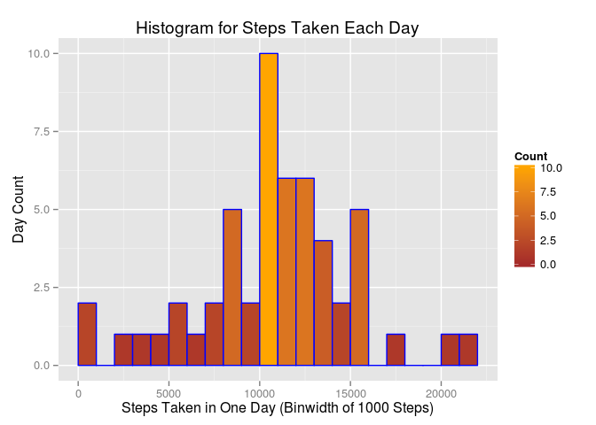

# Reproducible Research: Peer Assessment 1

## Introduction
The first task is to load any non-base libraries that my scripts will use. I'll 
detach these at the end of the presentation.


```r
library(dplyr) # for data wrangling
```

```
## 
## Attaching package: 'dplyr'
## 
## The following object is masked from 'package:stats':
## 
##     filter
## 
## The following objects are masked from 'package:base':
## 
##     intersect, setdiff, setequal, union
```

```r
library(ggplot2) # for good looking plots
```

## Loading and preprocessing the data

To answer the first few question, I decided to filter NA values from the steps data during import from the file. I will need to import the file again later when NA values become relevant to the analysis.


```r
act <- 
    read.csv("/home/tim/datasciencecoursera/Practicing-R/Reproducible Research/PeerAssessment1/activity.csv") %>% 
    filter(!is.na(steps))
act.steps.grouped <- group_by(act, date) # enables analysis by date factor.
act.steps.summary <- summarise(act.steps.grouped, sum = sum(steps)) # computes sum of steps for each day.
```

## What is mean total number of steps taken per day?

This script plots a histogram of the total number of steps taken each day. The standard binwidth is around 700 steps. I rounded up to binwidth of 1000 because I felt it captured a little more visual info about the distribution.


```r
p.steps <- ggplot(data = act.steps.summary, aes(x = sum)) + 
    geom_histogram(binwidth = 1000, 
                   col = "blue", 
                   aes(fill = ..count..)) +
    scale_fill_gradient("Count", low = "brown", high = "orange") +
    labs(title = "Histogram for Steps Taken Each Day") +
    labs(x = "Steps Taken in One Day (Binwidth of 1000 Steps)", y = "Day Count") +
    xlim(c(0, 22000))
p.steps
```

 

# 2. Calculate and report the **mean** and **median** total number of steps taken per day

The dplyr summarise() function computes these values to a new 2x1 data frame. [summarize[] is also valid spelling]
The mean and median values output below the script.


```r
centrality.steps <- 
    summarise(act.steps.summary, mean = mean(sum), median = median(sum))
centrality.steps
```

```
## Source: local data frame [1 x 2]
## 
##       mean median
## 1 10766.19  10765
```

## What is the average daily activity pattern?

This script plots a ggplot time series of the 5-minute-interval along the x-axis,
and the average number of steps taken, averaged across all days, along the y-axis.


```r
act.interval.grouped <- group_by(act, interval) # enables analysis by interval
act.interval.summary <- summarise(act.interval.grouped, mean = mean(steps)) # computes mean of steps by interval
p.interval <- ggplot(data = act.interval.summary, aes(x = interval, y = mean)) +
    geom_line(color = "blue") +
    labs(title = "Time Series of Steps Averaged Across All Days per Interval") +
    labs(x = "Interval", y = "Average Steps")
p.interval
```

 

# Which 5-minute interval, on average across all the days in the dataset, contains the maximum number of steps?

To answer this question, I subset the summary created in the previous script to identify the max mean.


```r
max.steps <- subset(act.interval.summary, mean == max(act.interval.summary$mean))
max.steps$interval
```

```
## [1] 835
```


## Imputing missing values

Earlier, I avoided handling NA steps values by filtering them from my file import. I now import from the file again to a new variable to include NAs. The number of NA rows is reported below the code chunk.


```r
act.with.na <- 
    read.csv("/home/tim/datasciencecoursera/Practicing-R/Reproducible Research/PeerAssessment1/activity.csv")
nrow(act.with.na[is.na(act.with.na$steps), ])
```

```
## [1] 2304
```

My strategy is to replace NA steps with the mean for the corresponding grouped interval. This mean was calculated earlier, and the trick to replacing with the correct mean is matching between the two tables by interval. This was tricky. I must have read over 30 stackoverflow and r-bloggers pages, and still didn't find the solution I arrived at. I chose to replace activity NAs with the total mean for that interval, the mean across all days. These values exist in another df that I compute earlier, and they are conditional by the interval value. These were two interesting obstacles. I kept thinking that I'd have to resort to a for loop, or I could use an apply() family function. But I kept hitting walls. I found I could accomplish this by using the following functions:

1. mutate() can accomplish all of this in a single function call.
2. ifelse() is the middle term in mutate. Replace steps IF is.na(steps). 
+ ELSE leave steps variable as is.
3. As mutate works row by row, row_number() is the key to matching the current activity df row with the mean row from the other df. 


```r
act.steps.imputed <- mutate(act.with.na, steps = ifelse(is.na(steps),
    act.interval.summary$mean[
        act.interval.summary$interval == 
            act.with.na$interval[row_number()]], 
    steps))
```

The above script is complicated, so I want to explain my procedure in more detail.
1. The whole script is a single mutate() function replacing the NAs with corresponding means in a new data frame. 
2. I give mutate() the new df including NAs.
3. IF the steps variable in an observation is NA, replace. ELSE leave steps alone.
4. The replacement value comes from the earlier interval means df. 
5. I use data frame indices to match the interval mean to the current row_number() of the new df. This chunk of the function is confusing to read so here is a logical rendition of that middle ifelse() term:
+ mean.df$mean[mean.df$interval == full.df$interval[row_number()]]

The next code chunk plots a histogram of the total number of steps taken each day. Then the mean and median total number of steps taken per day are reported. These show negligible impact of replacing NAs in the steps variable with interval means.


```r
act.steps.imputed.grouped <- group_by(act.steps.imputed, date)
act.steps.imputed.summary <- summarise(act.steps.imputed.grouped, sum = sum(steps))

p.steps.imputed <- ggplot(data = act.steps.imputed.summary, aes(x = sum)) + 
    geom_histogram(binwidth = 1000, 
                   col = "blue", 
                   aes(fill = ..count..)) +
    scale_fill_gradient("Count", low = "brown", high = "orange") +
    labs(title = "Histogram for Steps Taken Each Day") +
    labs(x = "Steps Taken in One Day (Binwidth of 1000 Steps)", y = "Day Count") +
    xlim(c(0, 22000))
p.steps.imputed
```

 

```r
centrality.steps.imputed <- summarise(act.steps.imputed.summary, 
                                      mean = mean(sum, na.rm = TRUE), 
                                      median = median(sum, na.rm = TRUE))
centrality.steps.imputed
```

```
## Source: local data frame [1 x 2]
## 
##       mean   median
## 1 10766.19 10765.59
```


Now we explore differences in activity patterns between weekdays and weekends.


```r
act.steps.imputed.grouped$day <- weekdays(as.Date(act.steps.imputed.grouped$date))
act.steps.imputed.grouped <- 
    mutate(act.steps.imputed.grouped, 
           day = ifelse(day == "Saturday" || day == "Sunday", "Weekend", "Weekday"))
act.steps.imputed.grouped$day <- as.factor(act.steps.imputed.grouped$day)

# 2. Make a panel plot containing a time series plot (i.e. `type = "l"`) 
# of the 5-minute interval (x-axis) and the average number of steps taken, 
# averaged across all weekday days or weekend days (y-axis). 

# abbreviating variable name act.steps.imputed.grouped as "asig"
# to keep name from getting out of hand.
asig.day <- group_by(act.steps.imputed.grouped, interval, day)
asig.day.summary <- summarise(asig.day, meansteps = mean(steps, na.rm = TRUE))

p.day <- ggplot(data = asig.day.summary, aes(x = interval, y = meansteps)) +
    geom_line(color = "blue") +
    labs(title = "Time Series of Steps Averaged Across All Days per Interval") +
    labs(x = "Interval", y = "Average Steps") +
    facet_grid(day ~ .)
p.day
```

 


```r
# cleanup!

detach(package:dplyr, unload = TRUE)
detach(package:ggplot2, unload = TRUE)
```
